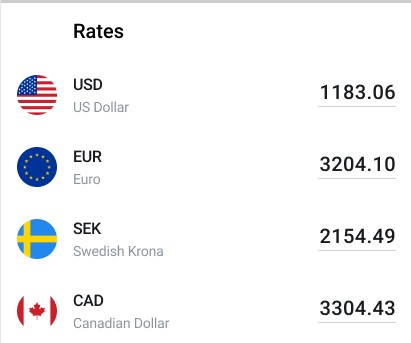

FirstRate Currency (Demo App)
=========================
A currency conversion app for Android that allows you to choose from a list of currencies, enter a value and see the corresponding valued of the other currencies. 

This is a demo application to demonstrate a design and an architectural approach, given a set of requirements.  

Introduction
------------
This is a one screen that shows a list of currencies, following a UI design that looks like this:

The app downloads and updates currency rates every 1 second using an API.

All currencies from the endpoint are listed one per row. Each row has an input where you can enter any amount of money.
When you tap on currency row, it slides to the top of the list and its input takes focus.
When you’re changing the amount, the app simultaneously updates the corresponding value for other currencies.

Although a demo application, the solution is production ready.

Architectural Approach & Design
---------
The application code is composed of 3 layers:

* UI Layer: what is shown on the screen.
* Domain Layer: does the calculation and conversion.
* Data Layer: handles the necessary data requirements - network and local.

Libraries/Dependencies
--------------
* [AndroidX][androidx]
* [Android Architecture Components][arch]
* [Android Data Binding][data-binding]
* [Dagger 2][dagger2] for dependency injection
* [Retrofit][retrofit] for REST api communication
* [Glide][glide] for image loading
* [espresso][espresso] for UI tests
* [mockito][mockito] for mocking in tests

[androidx]: https://developer.android.com/jetpack/androidx
[arch]: https://developer.android.com/arch
[data-binding]: https://developer.android.com/topic/libraries/data-binding/index.html
[espresso]: https://google.github.io/android-testing-support-library/docs/espresso/
[dagger2]: https://google.github.io/dagger
[retrofit]: http://square.github.io/retrofit
[glide]: https://github.com/bumptech/glide
[mockito]: http://site.mockito.org

